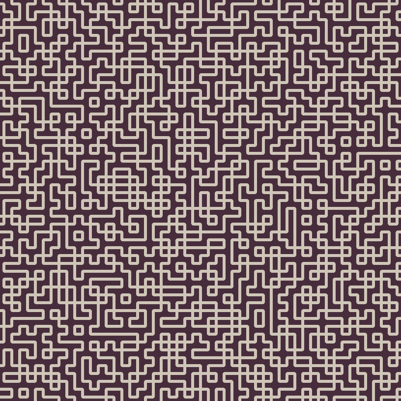

# Tile Map Generator (CZ)
Semestrální práce k předmětu NTI/ALD na Fakultě mechatroniky, informatiky a mezioborových studií, Technické univerzity v Liberci.

## Zadání
Cílem práce je vytvořit za pomocí libovolné technologie,
systém, který bude náhodně generovat uspořádání stavebních prvků herního světa
dle definovaných pravidel, tak, aby na sebe stavební prvky navazovaly.
Stavební prvky si můžeme představit jako čtvercovou dlaždici/obrázek.

## Použité technologie
- C++
- [OpenCV](https://github.com/opencv/opencv)
- [Kenny-Assets 1-Bit Pack](https://kenney-assets.itch.io/1-bit-pack)

## Algoritmy
### DFS (Depth-First Search)
DFS je použit pro prohledávání prostoru možných dlaždicových konfigurací. Algoritmus začíná od počátečního bodu a pokračuje do hloubky, dokud nenajde vhodnou dlaždici nebo nenarazí na slepou uličku. V případě slepé uličky se algoritmus vrátí zpět a zkouší jiné možnosti.

### BFS (Breadth-First Search)
BFS je použit pro prohledávání prostoru možných dlaždicových konfigurací v šířce. Algoritmus začíná od počátečního bodu a zkoumá všechny sousední dlaždice, než se ponoří do další úrovně.

### Backtracking
Backtracking je implementován v DFS algoritmu pro řešení situací, kdy není možné umístit další dlaždici. Algoritmus se v takovém případě vrátí o několik kroků zpět a zkouší jiné možnosti.

## Generování obrázku
Obrázky jsou generovány pomocí třídy `CImageConnector`, která mapuje dlaždice na odpovídající obrázky a vytváří finální vizualizaci mapy. Výsledný obrázek se ukládá do `./result.png`

## Konfigurace
Ukázková konfigurace se nachází v souboru `./tile_config.cfg`, který obsahuje i konečné dlaždice.
Další ukázková konfigurace v souboru `./tile_config_without_ends.cfg`, která neobsahuje koncové dlaždice.

Formát konfigurace:
```
name: NÁZEV_DLAŽDICE
image: CESTA_K_OBRÁZKU
symbol: SYMBOL_DLAŽDICE
top: MOŽNÉ_SPOJENÍ_NA_HORNÍ_STRANĚ_ODDĚLENÉ_MEZEROU
right: MOŽNÉ_SPOJENÍ_NA_PRAVÉ_STRANĚ_ODDĚLENÉ_MEZEROU
bottom: MOŽNÉ_SPOJENÍ_NA_DOLNÍ_STRANĚ_ODDĚLENÉ_MEZEROU
left: MOŽNÉ_SPOJENÍ_NA_LEVÉ_STRANĚ_ODDĚLENÉ_MEZEROU
```

## Příklad
Příklad pomocí DFS + backtracking s no-ending-tiles konfigurací:



## Zdroje dlaždic
Dlaždice použité v tomto projektu byly staženy z online zdarma repozitáře [Kenney 1-Bit Pack](https://kenney-assets.itch.io/1-bit-pack)

## Licence
Tile Map Generator © 2023 by Daniel Adámek is licensed under CC BY-NC 4.0. To view a copy of this license, visit http://creativecommons.org/licenses/by-nc/4.0/